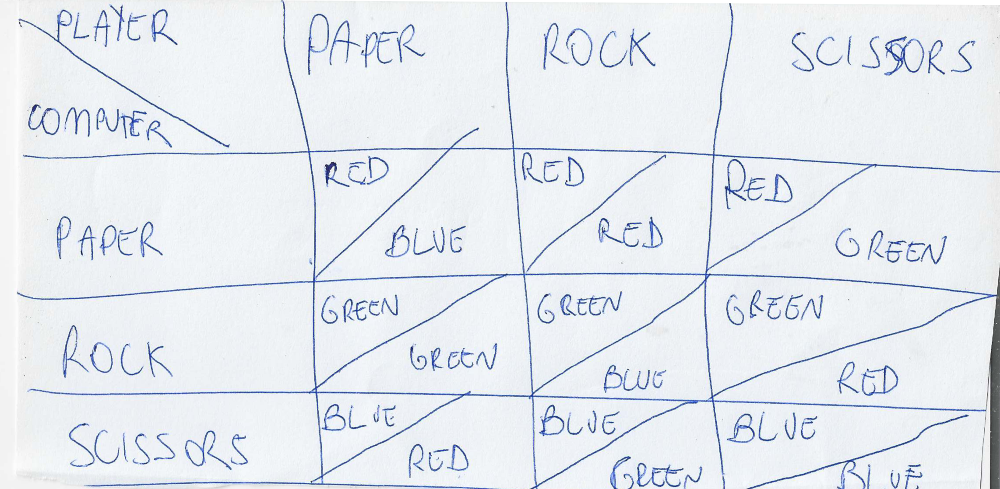
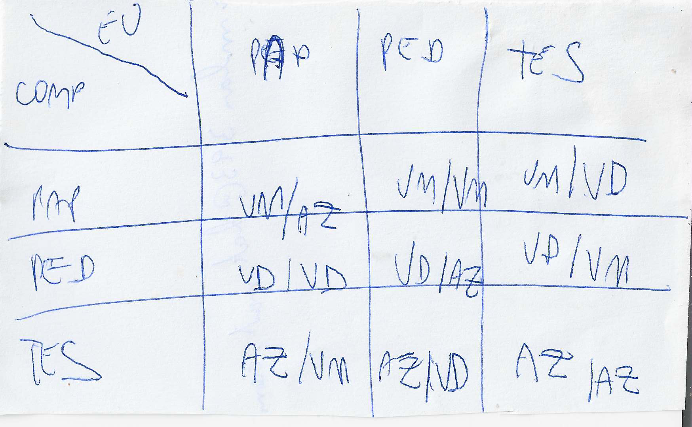

# jankenpo-arduino

## Introduction

In this Arduino project we can play Jankenpo against the computer. As you can see [in this demonstration](https://youtu.be/eoFyGKMtq78), you have in the circuit three buttons and 2 RGB LEDs. With the buttons you can choose you option (paper, rock or scissors). The first RGB LED will show the computer option (RED = paper, GREEN = rock, BLUE = scissors). You can think that the alphabetic order of paper/rock/scissors will be mapped to the order red, green and blue (RGB). And the other LED will show you the winner (RED = you loose, GREEN = you win, BLUE = draw).

As you can see in the video, the flow of the program is simple. First of all the first RGB LED will have all the colors off. And the second LED will be white (all colors on). The system is informing you that it is waiting you choose (you can choose an option pressing a button). After you pressing a button, the first and the second RGB LEDs will be RED, GREEN or BLUE, as you can see in this table: .

I will add a schematic diagram of the circuit soon.

This table is the table that I talked about in the video. It showes the colors of the two RGB LEDs. It depends of the random choice of the computer and the result (win, loss or draw):

The same table in portuguese:

And [this video](https://www.youtube.com/watch?v=GkwfqYYZ-VA) explain this table:

Videos showing the execution:

[https://youtu.be/GkwfqYYZ-VA](https://youtu.be/GkwfqYYZ-VA)

[https://youtu.be/eoFyGKMtq78](https://youtu.be/eoFyGKMtq78)
